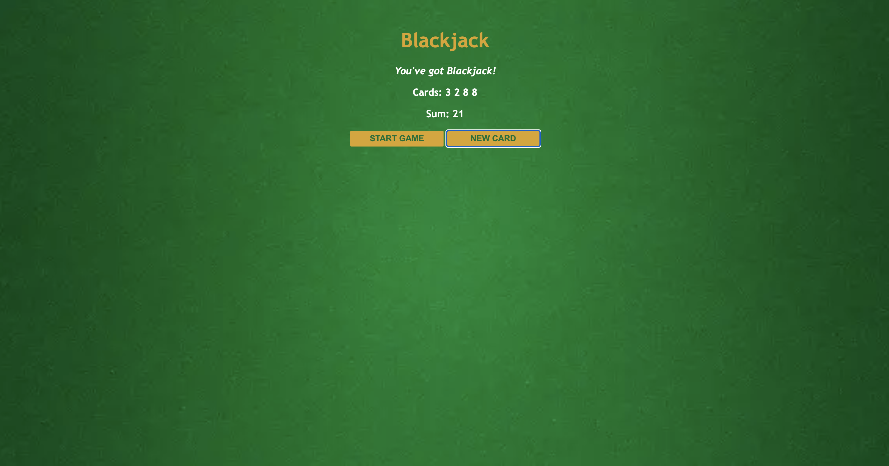

# Blackjack Game

This repository contains a simple **Blackjack Game** designed to enhance your understanding of JavaScript fundamentals.

## Overview

- **Blackjack Game**: Play a basic version of Blackjack by drawing cards and aiming for a sum of 21.

## Features

### Blackjack Game

- **Card Drawing**: Deal cards and calculate sums.
- **Game Logic**: Determine wins, losses, or continued play.
- **Simple UI**: Intuitive interface for interaction.

## Visual Design

Below is a visual representation of the webpage design:

### Starting Stage


### Drawing cards


### BlackJack



## Setup

1. Clone the repository and open `index.html` for the Blackjack Game in your browser:

```bash
git clone https://github.com/BhoomiGohil/Scrimba-JS-Blackjack.git
cd Scrimba-JS-Blackjack
```

2.  Open `index.html` in a browser.

```bash
open index.html
```

3.  For Blackjack, click **Start Game** and **New Card** to play.

## Topics Covered

- Random number generation
- Comparison and logical operators
- Array manipulation
- Function creation and invocation
- Object usage
